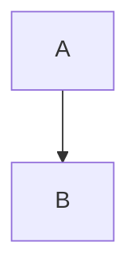

# `<all-roles>`

## Usage

0. If you haven't already, [go through the setup for the module](/setup).

1. Import the `<all-roles>` element somewhere in the javascript side of your web-app like this:

```js
import '@darksoil-studio/roles/dist/elements/all-roles.js'
```

2. Use it in the html side of your web-app like this:

```html
<all-roles>
</all-roles>
```

> [!WARNING]
> Like all the elements in this module, `<all-roles>` needs to be placed inside an initialized `<roles-context>`.

## Demo

Here is an interactive demo of the element:

<element-demo>
</element-demo>



<script setup>
import { onMounted } from "vue";
import { ProfilesClient, ProfilesStore } from '@holochain-open-dev/profiles';
import { demoProfiles, ProfilesZomeMock } from '@holochain-open-dev/profiles/dist/mocks.js';
import { decodeHashFromBase64, encodeHashToBase64 } from '@holochain/client';
import { render } from "lit";
import { html, unsafeStatic } from "lit/static-html.js";

import { RolesZomeMock, sampleRoleClaim } from "../../ui/src/mocks.ts";
import { RolesStore } from "../../ui/src/roles-store.ts";
import { RolesClient } from "../../ui/src/roles-client.ts";

onMounted(async () => {
  // Elements need to be imported on the client side, not the SSR side
  // Reference: https://vitepress.dev/guide/ssr-compat#importing-in-mounted-hook
  await import('@api-viewer/docs/lib/api-docs.js');
  await import('@api-viewer/demo/lib/api-demo.js');
  await import('@holochain-open-dev/profiles/dist/elements/profiles-context.js');
  if (!customElements.get('roles-context')) await import('../../ui/src/elements/roles-context.ts');
  if (!customElements.get('all-roles')) await import('../../ui/src/elements/all-roles.ts');

  const profiles = await demoProfiles();

  const profilesMock = new ProfilesZomeMock(
    profiles,
    Array.from(profiles.keys())[0]
  );
  const profilesStore = new ProfilesStore(new ProfilesClient(profilesMock, "roles_test"));

  const mock = new RolesZomeMock();
  const client = new RolesClient(mock, "roles_test");

  const roleClaim = await sampleRoleClaim(client);

  const record = await mock.create_role_claim(roleClaim);

  const store = new RolesStore(client, {
    roles_config: [{
      role: 'editor',
      singular_name: 'editor',
      plural_name: 'editor',
      description: 'editor',
    }]
  });
  
  render(html`
    <profiles-context .store=${profilesStore}>
      <roles-context .store=${store}>
        <api-demo src="custom-elements.json" only="all-roles" exclude-knobs="store">
          <template data-element="all-roles" data-target="host">
            <all-roles ></all-roles>
          </template>
        </api-demo>
      </roles-context>
    </profiles-context>
  `, document.querySelector('element-demo'))
  })


</script>

## API Reference

`<all-roles>` is a [custom element](https://web.dev/articles/custom-elements-v1), which means that it can be used in any web app or website. Here is the reference for its API:

<api-docs src="custom-elements.json" only="all-roles">
</api-docs>
